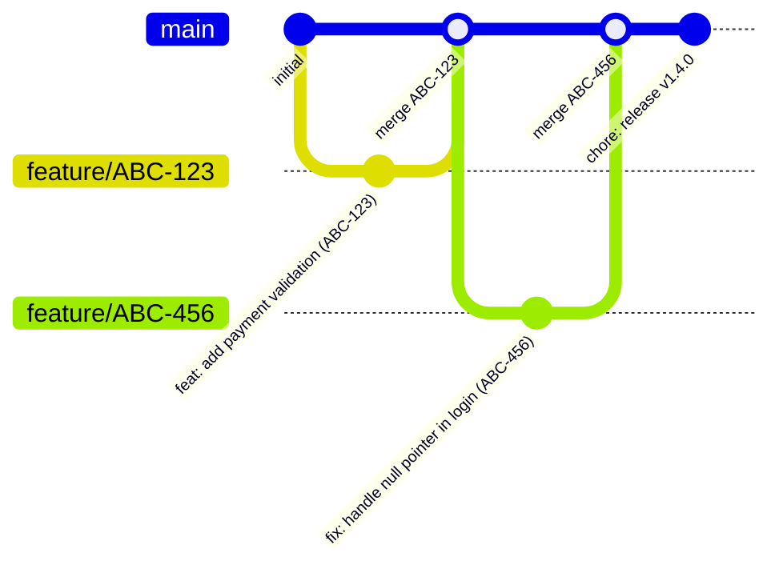
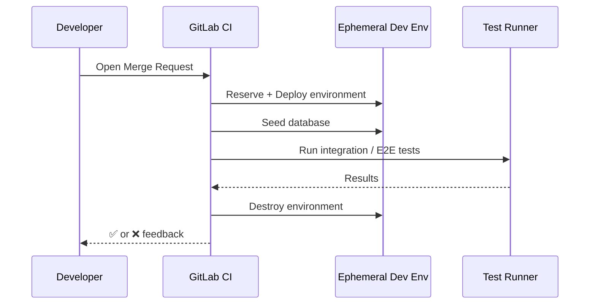
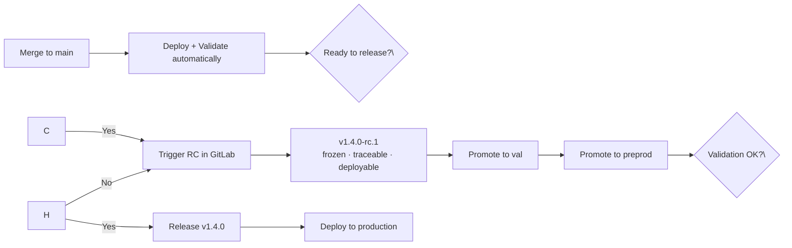
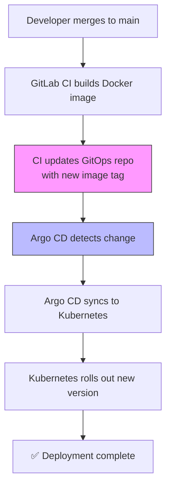
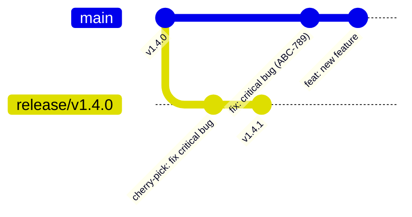
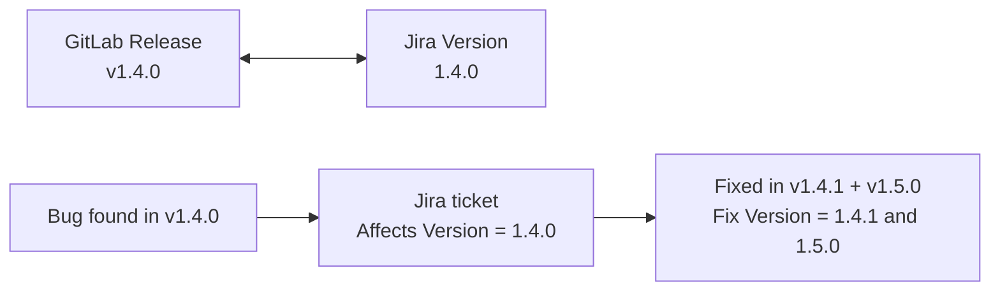
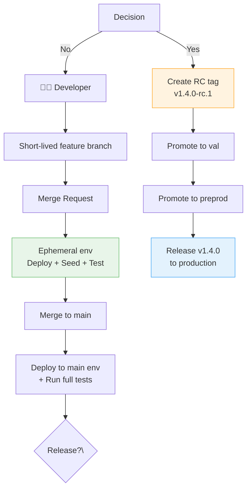
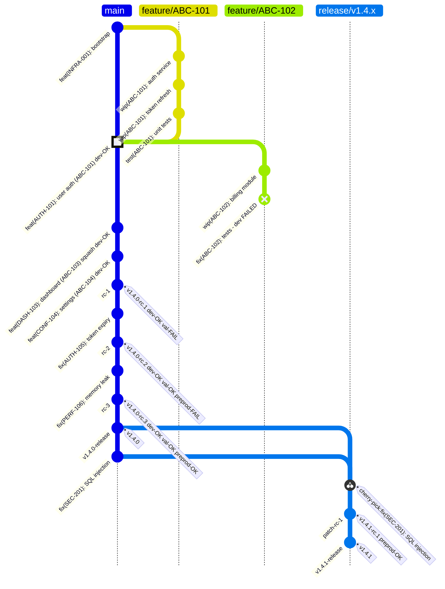

In my previous post — [Why I Think Git Flow Doesn't Fit Most Projects Anymore](/articles/articles/2025/11/07/git-flow-doesnt-fit-anymore.html) — I explained why I believe Git Flow adds more friction than value for most modern teams. I got some good feedback, and a fair amount of "okay, but then what should we do instead?"

This post is the concrete answer.

There are countless ways to structure a development workflow. Git Flow, environment branches, release branches… many of them made sense at some point. But if you're building modern applications — containerized, deployed on Kubernetes, running in the cloud — most of those patterns are now more friction than value.

This is what I believe is **the best default workflow for most teams today**:

* **Trunk-Based Development**
* **GitLab-driven releases**
* **Ephemeral environments for testing**
* **GitOps deployment with Kubernetes**
* **Tight integration with Jira**

It's simple, fast, and scales well.

<!-- more -->

## The Core Idea: One Branch, Continuous Validation

At the heart of this model is a simple rule:

> There is only one long-lived branch: `main`.

Everything flows through it. Developers create short-lived feature branches, merge quickly into `main`, and every merge triggers a **real deployment + real tests**.

No `develop`, no environment branches, no long-lived release branches.

Why? Because branches don't give you safety — **tests and automation do**.



---

## Dev Is Not an Environment — It's a Test Platform

One of the biggest shifts in this model is how we think about environments.

`dev` is **not** a shared playground. It is:

* **Ephemeral** — created on demand, destroyed after use
* **Reserved automatically by GitLab** — no manual coordination
* **Deployed from the exact branch or commit being tested**
* **Seeded with a known database state** — reproducible every time

Every Merge Request follows this lifecycle:



This gives you something most teams *think* they have, but actually don't:

> **Production-like validation on every change**

---

## Releases Are Intentional (and Owned by GitLab)

A key mistake in many setups is coupling *merge* and *release*.

In this model:

* Merging to `main` = **integration + validation**
* Releasing = **explicit, intentional decision**

Releases are triggered from GitLab, not from a developer's laptop.

### The Release Flow



The Release Candidate (`v1.4.0-rc.1`) is:

* **Frozen** — the exact artifact that goes through the whole pipeline
* **Traceable** — linked to specific commits and Jira tickets
* **Promotable** — same image, same config, just a different environment

---

## Kubernetes + GitOps: Deployment Becomes Boring (That's Good)

Once you adopt containers and GitOps, deployment becomes predictable and auditable.

A typical stack looks like:

* **Kubernetes** (AKS, GKE, EKS…)
* **Helm** for templating
* **Argo CD** for continuous delivery



No SSH. No manual deployments. No "it works on my machine."

The Git repository is the single source of truth for what runs in each environment.

---

## Maintenance Without Blocking the World

At some point, production needs a fix and you can't wait for the next regular release.

Instead of reviving Git Flow's hotfix branches, we keep it simple:



1. Create a maintenance branch from the release tag:  `release/v1.4.0`
2. Fix is developed on `main` first
3. Cherry-picked into the maintenance branch
4. New patch version `v1.4.1` is released

Meanwhile, `main` keeps moving forward. There's no freeze, no coordination overhead.

---

## The Missing Piece: Jira + Commits + Versions

This is where many teams struggle. You want:

* Clean commit history
* Automation-friendly commits
* Jira traceability

You can have all three — but you need a convention.

### Conventional Commits + Jira: The Practical Approach

Use **Conventional Commits**, and include the Jira ticket in the message.

Two solid options:

**Option A (recommended — simple and readable):**

```
feat: add payment validation (ABC-123)
fix: handle null pointer in login (ABC-456)
```

**Option B (more structured, better for tooling):**

```
feat(ABC-123): add payment validation
fix(ABC-456): handle login error
```

Both work. The key is **consistency**.

* Commit type (`feat`, `fix`, etc.) drives **changelogs and versioning**
* Jira ID ensures **traceability**

### Jira Versions Must Match GitLab Releases



Use Jira fields properly:

* **Fix Version** → version(s) where the issue is *delivered*
* **Affects Version** → version(s) where the issue was *observed*

This gives you clean release notes, accurate traceability, and better communication with QA and stakeholders.

---

## Git Hygiene Matters More Than You Think

This workflow depends on a clean, readable history.

### Rebase Before Merge

```bash
git fetch origin
git rebase origin/main
```

* Avoids messy merge histories
* Reduces conflicts by integrating early
* Keeps `main` linear and readable

### Keep Changes Small

This is the real secret of Trunk-Based Development:

> Small changes → fast reviews → fewer conflicts → safer releases

A change that lives in a branch for days accumulates risk. Merge frequently, merge small.

---

## Why This Works So Well

This model aligns every part of your toolchain:

| Layer | What it does |
|---|---|
| **Git** | Simple — `main` is the only long-lived branch |
| **CI** | Always validates real deployments |
| **CD** | Automated via GitOps |
| **Releases** | Controlled, explicit, owned by GitLab |
| **Jira** | Aligned with versions and commits |

It removes entire categories of problems:

* "Which branch is deployed where?"
* "Why does staging differ from prod?"
* "What exactly is in this release?"

---

## The Full Picture



---

## The Complete Git Timeline

Here is the full story in one diagram: feature development, a blocked MR, RC promotion across environments, and a patch release from a maintenance branch.



**How to read this:**

- 🟡 Highlighted merge commit → feature branch rebased, dev-validated, merged with conventional commit + Jira ref
- 🔴 Red commit → dev test failure — MR blocked, never merged to `main`
- `squash` commit → multi-commit MR squashed to a single clean conventional commit on `main`
- RC tags annotated with per-environment validation result (`dev`, `val`, `preprod`)
- `release/v1.4.x` → maintenance branch: hotfix committed first to `main`, cherry-picked to the release branch, RC validated in preprod, then released as `v1.4.1`

---

## Final Thought

You can build extremely complex workflows. Or you can accept a simpler truth:

> One branch, strong automation, and explicit releases is enough for most teams.

If you're running containers on Kubernetes and still using Git Flow, you're probably carrying complexity you don't need anymore.

If I had to start a new project today, this is the workflow I would pick every time.

---

*Have questions or a different experience? Share it in the comments below — I'm genuinely curious how others have handled this in practice.*
